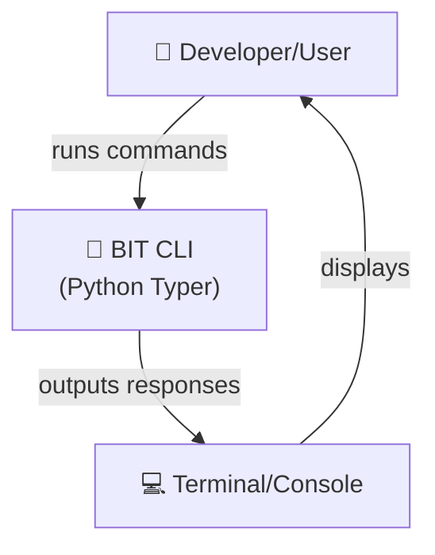
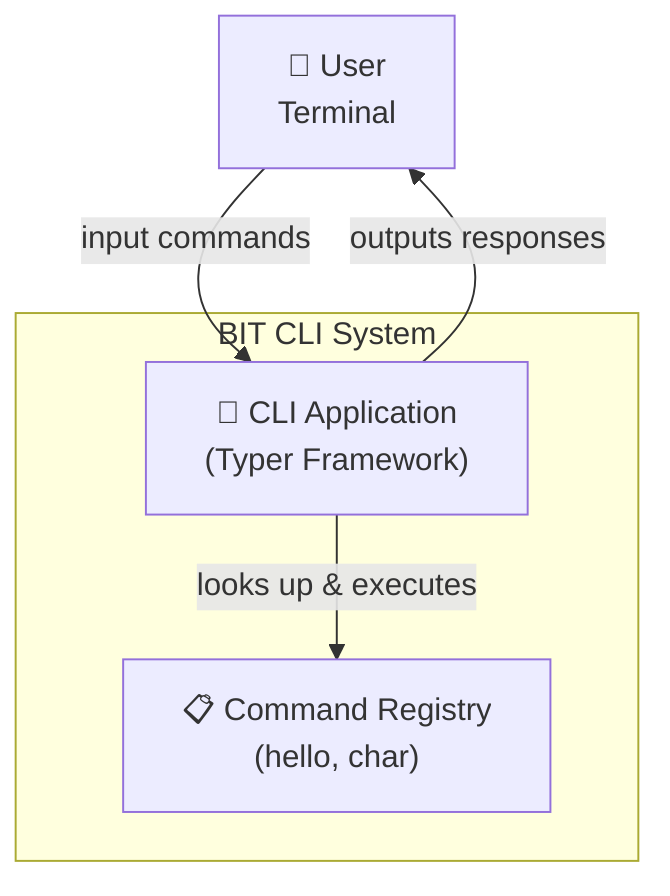
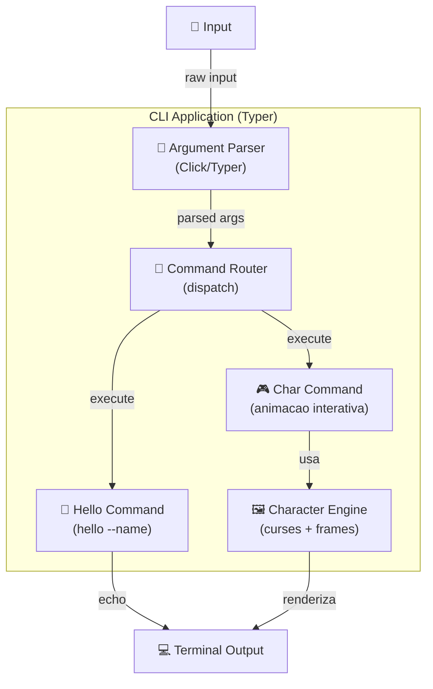
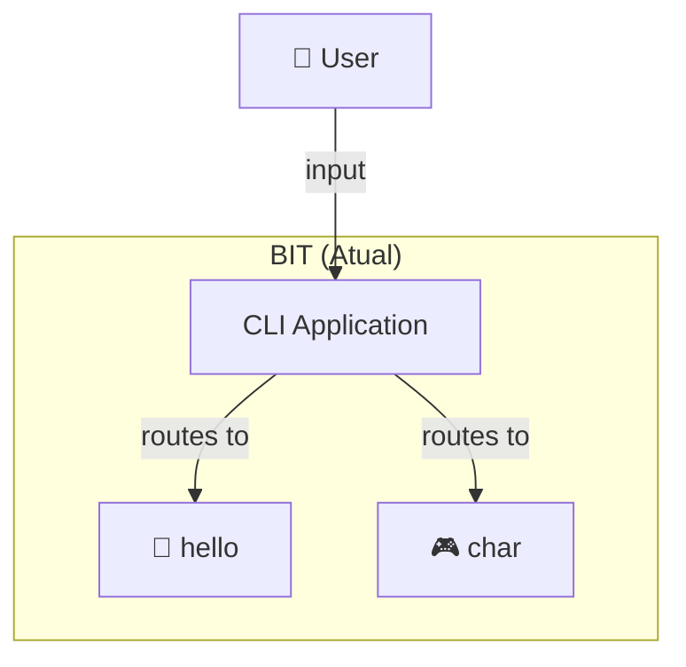
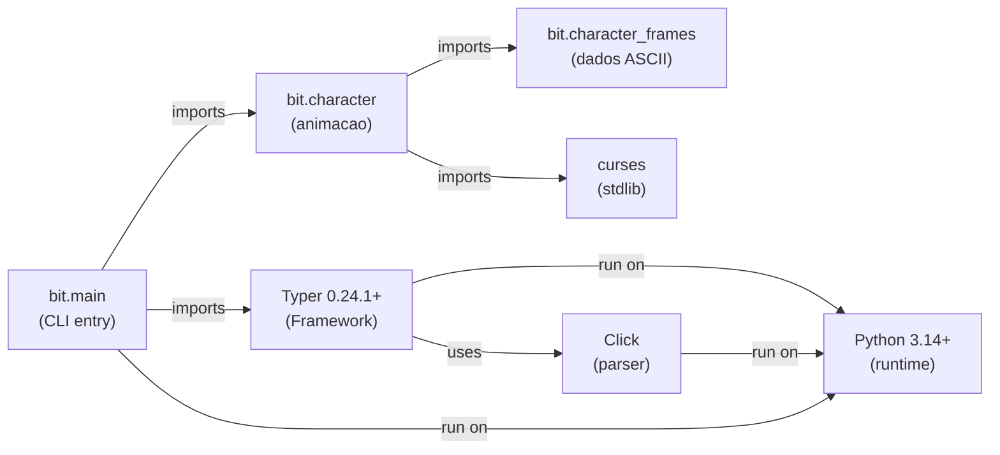

# C4 Architecture Model - Projeto BIT

Documentação de arquitetura do projeto `bit` usando o modelo C4.

---

## 1. Context Diagram (Contexto - 30.000 pés)

Visão de **alto nível** do sistema e seus atores externos.



**Descrição:**
- Um desenvolvedor/usuário interage com o CLI `bit` via linha de comando
- O sistema processa comandos e retorna respostas no terminal

---

## 2. Container Diagram (Contêineres - Arquitetura Geral)

Componentes principais do sistema.



**Contêineres:**

| Contêiner | Responsabilidade | Tecnologia |
|-----------|-----------------|-----------|
| **CLI Application** | Processa comandos, orquestra execução | Typer (CLI Framework) |
| **Command Registry** | Armazena definições de comandos disponíveis | Python Functions (@app.command) |

---

## 3. Component Diagram (Componentes - Dentro de CLI Application)

Detalhe interno da aplicação.



**Componentes:**

| Componente | Função |
|-----------|--------|
| **Argument Parser** | Extrai e valida argumentos de linha de comando |
| **Command Router** | Roteia para handler apropriado baseado no comando |
| **Hello Command** | Formata mensagem de saudacao e imprime |
| **Char Command** | Inicia animacao interativa de personagem |
| **Character Engine** | Renderiza frames ASCII com curses, gerencia estados (idle, sleeping, working) |

---

## 4. Data Flow (Fluxo de Dados)

Como um comando flui atraves do sistema:

### hello

```
bit hello --name "World"
  → Argument Parser: identifica "hello", extrai name="World"
  → Command Router: encontra handler hello
  → Hello Command: typer.echo(f"Hello, {name}!")
  → Terminal: "Hello, World!"
```

### char

```
bit char
  → Argument Parser: identifica "char"
  → Command Router: encontra handler char
  → Char Command: chama character()
  → Character Engine (curses):
      - Inicializa terminal curses
      - Loop: le input (A/S/D/Q), seleciona frames, renderiza
      - Q encerra e restaura terminal
```

---

## 5. Modulos e Responsabilidades

| Modulo | Responsabilidade |
|--------|-----------------|
| `bit/main.py` | Entry point CLI, define comandos hello e char |
| `bit/character.py` | Engine de animacao: curses, estados, loop de render |
| `bit/character_frames.py` | Dados: frames ASCII para idle, sleeping, working |

---

## 6. Technology Stack

| Camada | Tecnologia | Propósito |
|--------|-----------|----------|
| **Framework CLI** | Typer 0.24.1+ | Definição e execução de comandos |
| **Parsing** | Click (via Typer) | Parsing de argumentos CLI |
| **Output** | typer.echo / curses | Saida formatada e animacao terminal |
| **Language** | Python 3.14+ | Runtime |
| **Build** | Hatchling | Build system |

---

## 7. Arquitetura Evolutiva

### Estado Atual



### Possiveis Expansoes

Novos comandos seguem o mesmo padrao: funcao com `@app.command()` em `main.py`, logica em modulo dedicado.

---

## 8. Dependências do Projeto



---

## 9. Setup

Ver [README.md](README.md) para instrucoes de instalacao e uso.

---

## Referências

- [C4 Model](https://c4model.com/)
- [Typer Documentation](https://typer.tiangolo.com/)
- [Click Documentation](https://click.palletsprojects.com/)
